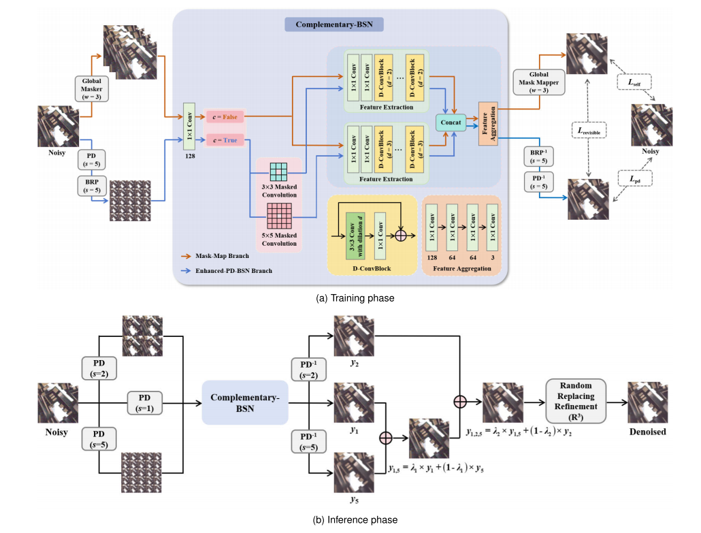
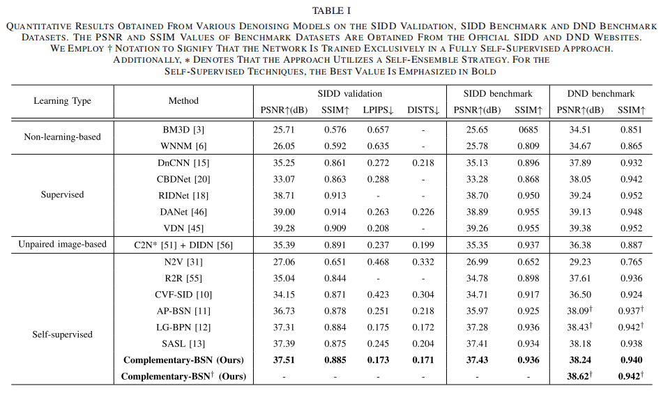
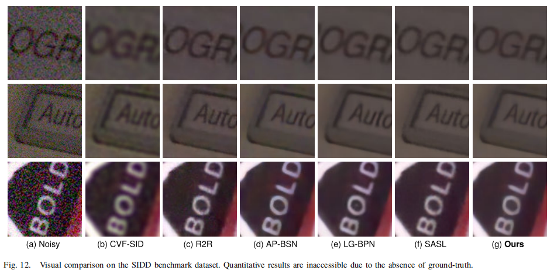

# Complementary Blind-Spot Network for Self-Supervised Real Image Denoising

This is an official PyTorch implementation of "Complementary Blind-Spot Network for Self-Supervised Real Image Denoising" in IEEE TCSVT 2024.




[[Paper](https://ieeexplore.ieee.org/document/10531274/figures#figures)]

---

## Setup

### Requirements

Our experiments are done with:

- Python 3.9.5
- PyTorch 1.9.0
- numpy 1.21.0
- opencv 4.5.2
- scikit-image 0.18.1

### Directory

Follow below descriptions to build code directory.

```
AP-BSN
├─ ckpt
├─ conf
├─ dataset
│  ├─ DND
│  ├─ SIDD
│  ├─ NIND
│  ├─ prep
├─ figs
├─ output
├─ src
```

### Pre-trained Models

You can download pretrained checkpoints of our method. Place these files into `ckpt` folder.

|     Dataset   |      Config file     | Pre-trained       |code|
| :------------: | :------------------: | :---------------: |:---------:|
|   SIDD      |     APBSN_SIDD.yaml   | [Complementary-BSN_SIDD.pth](https://pan.baidu.com/s/1GpIvQlQ0J--fA2rppjVdZA?pwd=urqe) |urqe|
|   DND    |    APBSN_DND.yaml   | [Complementary-BSN_DND.pth](https://pan.baidu.com/s/1chqVZOmhdAV28aN2L-iYXA?pwd=8its) |8its|


## Training & Test

### Training


```
# Train AP-BSN for the SIDD dataset using gpu:0
python train.py -c APBSN_SIDD -g 0
```

### Test
```
# Test SIDD dataset for pre-trained model (./ckpt/Complementary_SIDD.pth) in gpu:0
python test.py -c APBSN_SIDD -g 0 --pretrained Complementary_SIDD.pth
```

---

## Results

### Quantitative results

Here is reported results of AP-BSN. Please refer our paper for more detailed results.



### Qualitative results



## Ciatation

```
@ARTICLE{10531274,
  author={Fan, Linwei and Cui, Jin and Li, Huiyu and Yan, Xiaoyu and Liu, Hui and Zhang, Caiming},
  journal={IEEE Transactions on Circuits and Systems for Video Technology}, 
  title={Complementary Blind-Spot Network for Self-Supervised Real Image Denoising}, 
  year={2024},
  volume={34},
  number={10},
  pages={10107-10120},
  doi={10.1109/TCSVT.2024.3402095}}
```

---
